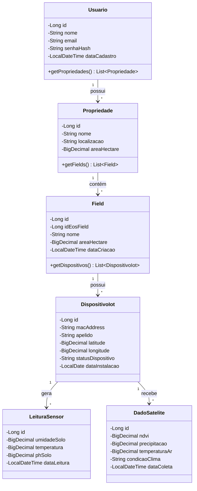
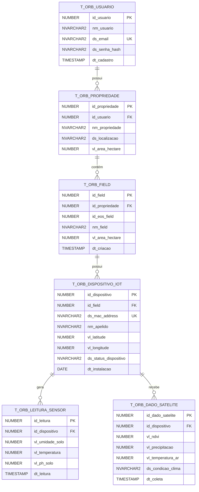

# CaneOrbit — Economia Espacial Aplicada à Agricultura

> API REST de monitoramento agrícola de precisão para cultivo de cana-de-açúcar, integrando sensores IoT (ESP32), imagens de satélite (EOS) e análise com IA (Gemini).

---

## 🔗 Links do Projeto

| Recurso | Link |
| :--- | :--- |
| **Repositório GitHub (Java)** | https://github.com/FIAP-CANEORBIT/fiap-2tdspo-caneorbit-java |
| **Repositório GitHub (C#)** | https://github.com/FIAP-CANEORBIT/caneorbis-api-dotnet |
| **Swagger UI - Java (Produção)** | https://caneorbis-api-java.onrender.com/swagger-ui/index.html |
| **Swagger UI - Java (Local)** | http://localhost:8080/swagger-ui.html |
| **Swagger UI - C# (Produção)** | https://caneorbis-api-dotnet.onrender.com/swagger |
| **Swagger UI - C# (Local)** | http://localhost:5000/swagger |
| **API Java Base (Produção)** | https://caneorbis-api-java.onrender.com |
| **API C# Base (Produção)** | https://caneorbis-api-dotnet.onrender.com |
| **Vídeo de Apresentação (10 min)** | *em breve* |
| **Video Pitch (3 min)** | *em breve* |

---

## 📋 Descrição

O **CaneOrbit** é uma plataforma de agricultura de precisão que permite a produtores rurais:

- Cadastrar propriedades, talhões (fields) e dispositivos IoT de campo
- Receber leituras em tempo real de sensores ESP32 (umidade do solo, temperatura, pH)
- Integrar dados de satélite via API EOS (NDVI, precipitação, temperatura do ar)
- Obter análises e recomendações inteligentes via modelo Gemini (Google)

### Arquitetura Multi-API

O projeto é composto por **duas APIs independentes** que compartilham o mesmo banco de dados Oracle:

| API | Tecnologia | Responsabilidade |
| :--- | :--- | :--- |
| **API Java** | Spring Boot 3.x | CRUD de usuários, propriedades, dispositivos e leituras de sensor |
| **API C#** | ASP.NET Core | Integração com EOS (satélite) e Gemini (IA) |

Ambas as APIs estão em produção no Render e podem ser acessadas pelos links acima.

---

## 💼 Benefícios para o Negócio

- **Redução de Custos:** Monitoramento remoto elimina deslocamentos e inspeções manuais desnecessárias.
- **Aumento de Produtividade:** Alertas baseados em dados de satélite permitem intervenção rápida em áreas críticas.
- **Sustentabilidade:** Uso eficiente de água e insumos com base em análises de NDVI e precipitação.
- **Decisão Baseada em Dados:** Histórico de leituras e imagens de satélite consolidados em um único sistema.
- **Diferencial Competitivo:** Integração com EOS, dispositivos IoT de baixo custo e IA Gemini.

---

## 🛠️ Tecnologias Utilizadas

### API Java (Spring Boot)

| Tecnologia | Uso |
| :--- | :--- |
| Java 21 | Linguagem principal |
| Spring Boot 3.x | Framework da API |
| Spring Data JPA / Hibernate | Persistência e ORM |
| Spring Security + JWT (Auth0) | Autenticação e autorização |
| Spring Validation | Validação de payloads |
| Lombok | Produtividade e redução de boilerplate |
| Spring Boot DevTools | Hot reload em desenvolvimento |
| Oracle Database | Banco de dados relacional |
| Swagger / OpenAPI 3 (Springdoc) | Documentação interativa |
| Maven | Gerenciamento de dependências |

### API C# (ASP.NET Core)

| Tecnologia | Uso |
| :--- | :--- |
| C# / .NET 8 | Linguagem e framework |
| Entity Framework Core | ORM e migrations |
| Oracle EF Core Driver | Conexão com Oracle |
| API EOS | Dados de satélite e NDVI |
| API Gemini (Google) | Análises com IA |
| Swagger / OpenAPI | Documentação interativa |

### Infraestrutura Compartilhada

| Tecnologia | Uso |
| :--- | :--- |
| Oracle Database | Banco de dados relacional (Docker + Render) |
| Docker Compose | Orquestração local |
| Render | Deploy público (duas APIs + banco) |

---

## ⚙️ Configuração do Ambiente (Local)

### Pré-requisitos

- **JDK 21**
- **.NET 8 SDK**
- **Docker Desktop**
- **Maven 3.9+**
- **Git**

### Passo a Passo

**1. Clone os repositórios**

```bash
git clone https://github.com/FIAP-CANEORBIT/fiap-2tdspo-caneorbit-java.git
git clone https://github.com/FIAP-CANEORBIT/caneorbis-api-dotnet.git
```

**2. Entre na pasta do projeto Java**

```bash
cd fiap-2tdspo-caneorbit-java
```

**3. Configure as variáveis de ambiente (ou use o docker-compose na raiz)**

Crie um arquivo `.env` na raiz do projeto:

```env
DB_PASSWORD=oracle123
JWT_SECRET=minha-chave-secreta-123
```

**4. Suba os containers com Docker Compose**

Na raiz do projeto (onde está o `docker-compose.yml`):

```bash
docker compose up -d --build
```

Isso irá subir:
- Oracle Database (porta 1521)
- API Java (porta 8080)
- API C# (porta 5000)

**5. Verifique se tudo está rodando**

```bash
docker ps
```

Você deve ver 3 containers rodando:
- `caneorbit-oracle-db-*` (banco de dados)
- `caneorbit-csharp-api-*` (API C#)
- `caneorbit-java-api-*` (API Java)

**6. Acesse as documentações**

| API | URL Local |
| :--- | :--- |
| Swagger Java | http://localhost:8080/swagger-ui.html |
| Swagger C# | http://localhost:5000/swagger |

---

## 🚀 Acessando as APIs em Produção (Render)

| Recurso | URL |
| :--- | :--- |
| **Swagger Java** | https://caneorbis-api-java.onrender.com/swagger-ui/index.html |
| **Swagger C#** | https://caneorbis-api-dotnet.onrender.com/swagger |
| **API Java Base** | https://caneorbis-api-java.onrender.com |
| **API C# Base** | https://caneorbis-api-dotnet.onrender.com |

---

## 📡 Endpoints da API Java

> Endpoints marcados com 🔒 requerem `Authorization: Bearer <TOKEN>`.

### Usuários & Autenticação

| Método | Endpoint | Descrição | Auth |
| :--- | :--- | :--- | :--- |
| POST | `/api/usuarios/register` | Cadastra novo usuário | — |
| POST | `/api/auth/login` | Autentica e retorna JWT | — |

### Propriedades

| Método | Endpoint | Descrição | Auth |
| :--- | :--- | :--- | :--- |
| POST | `/api/propriedades` | Cadastra propriedade | 🔒 |
| GET | `/api/propriedades` | Lista todas | 🔒 |
| GET | `/api/propriedades/minhas` | Lista do usuário logado | 🔒 |
| GET | `/api/propriedades/{id}` | Busca por ID | 🔒 |
| PUT | `/api/propriedades/{id}` | Atualiza | 🔒 |
| DELETE | `/api/propriedades/{id}` | Remove | 🔒 |
| GET | `/api/propriedades/{id}/fields` | Lista fields da propriedade | 🔒 |

### Dispositivos IoT

| Método | Endpoint | Descrição | Auth |
| :--- | :--- | :--- | :--- |
| POST | `/api/dispositivos` | Cadastra dispositivo | 🔒 |
| GET | `/api/dispositivos/meus` | Lista do usuário logado | 🔒 |
| GET | `/api/dispositivos/{id}` | Busca por ID | 🔒 |
| PUT | `/api/dispositivos/{id}` | Atualiza | 🔒 |
| DELETE | `/api/dispositivos/{id}` | Remove | 🔒 |
| GET | `/api/dispositivos/{id}/dados-satelite` | Dados de satélite (via C#) | 🔒 |

### Leituras de Sensor

| Método | Endpoint | Descrição | Auth |
| :--- | :--- | :--- | :--- |
| POST | `/api/leituras` | Registra leitura (ESP32) | — |
| GET | `/api/leituras/dispositivo/{id}` | Lista por dispositivo | — |
| GET | `/api/leituras/minhas` | Lista do usuário logado | 🔒 |
| GET | `/api/leituras/{id}` | Busca por ID | 🔒 |
| DELETE | `/api/leituras/{id}` | Remove | 🔒 |

### Status Codes Esperados

| Operação | Status |
| :--- | :--- |
| Criação | 201 Created |
| Leitura / Atualização | 200 OK |
| Remoção | 204 No Content |
| Não encontrado | 404 Not Found |
| Dados inválidos | 400 Bad Request |
| Não autorizado | 401 Unauthorized |

---

## 🧪 Exemplos de Requisições (Produção - Java)

### 1. Cadastrar usuário

```bash
curl -X POST https://caneorbis-api-java.onrender.com/api/usuarios/register \
  -H "Content-Type: application/json" \
  -d '{"nome":"Joao Silva","email":"joao@email.com","senha":"123456"}'
```

### 2. Fazer login (obter token)

```bash
curl -X POST https://caneorbis-api-java.onrender.com/api/auth/login \
  -H "Content-Type: application/json" \
  -d '{"email":"joao@email.com","senha":"123456"}'
```

### 3. Criar propriedade (usando token)

```bash
TOKEN="seu_token_aqui"

curl -X POST https://caneorbis-api-java.onrender.com/api/propriedades \
  -H "Content-Type: application/json" \
  -H "Authorization: Bearer $TOKEN" \
  -d '{"nome":"Fazenda Boa Vista","localizacao":"SP","areaHectare":150.5}'
```

### 4. Criar dispositivo

```bash
curl -X POST https://caneorbis-api-java.onrender.com/api/dispositivos \
  -H "Content-Type: application/json" \
  -H "Authorization: Bearer $TOKEN" \
  -d '{"macAddress":"AA:BB:CC:DD:EE:FF","apelido":"Sensor 01","latitude":-23.5505,"longitude":-46.6333,"statusDispositivo":"ATIVO","dataInstalacao":"2024-01-15"}'
```

### 5. Criar leitura de sensor

```bash
curl -X POST https://caneorbis-api-java.onrender.com/api/leituras \
  -H "Content-Type: application/json" \
  -d '{"idDispositivo":1,"umidadeSolo":45.5,"temperatura":28.3,"phSolo":6.2}'
```

### 6. Listar leituras de um dispositivo

```bash
curl -X GET "https://caneorbis-api-java.onrender.com/api/leituras/dispositivo/1"
```

---

## 🧪 Exemplos de Requisições (Produção - C#)

### Listar todas as leituras de sensor

```bash
curl -X GET https://caneorbis-api-dotnet.onrender.com/api/LeituraSensor
```

### Buscar leitura por ID

```bash
curl -X GET https://caneorbis-api-dotnet.onrender.com/api/LeituraSensor/1
```

---

## 📚 Decisões Técnicas (API Java)

**Autenticação Stateless (JWT):** Após login em `/api/auth/login`, um token JWT com validade de 24h é emitido. Envie-o no header `Authorization: Bearer <TOKEN>` nas requisições protegidas.

**HATEOAS:** Os ResponseDTOs incluem links de navegação (`_links`) seguindo o Nível 3 do Richardson Maturity Model, permitindo que clientes descubram ações disponíveis a partir das respostas.

**Tratamento Global de Exceções:** `@RestControllerAdvice` padroniza respostas de erro em `ErroResponseDTO`, cobrindo validações, recursos não encontrados, credenciais inválidas e erros de sistema.

**DTOs e Records:** A camada de domínio nunca é exposta diretamente. `RequestDTOs` validam entradas com `@NotBlank`, `@Email`, etc. `ResponseDTOs` (incluindo Java Records onde aplicável) definem saídas intermediadas por mappers desacoplados.

**Lombok e DevTools:** Usados para eliminar boilerplate (getters, construtores, builders) e habilitar hot reload durante o desenvolvimento.

**CORS:** Configurado via `SecurityConfig` para permitir acesso ao deploy público.

**Modelagem Avançada:** O modelo de dados contempla herança, campos `@Embedded` e múltiplas tabelas relacionadas conforme descrito no DER abaixo.

---

## 🏗️ Modelo de Maturidade REST (Richardson)

| Nível | Descrição | Status |
| :--- | :--- | :--- |
| Nível 0 | POX | ❌ Não aplicável |
| Nível 1 | Resources | ✅ Endpoints organizados por recurso |
| Nível 2 | HTTP Verbs | ✅ GET, POST, PUT, DELETE com status semânticos |
| Nível 3 | HATEOAS | ✅ Links de navegação nos ResponseDTOs |

---

## 📊 Diagramas

### Diagrama de Classes (UML)



### Diagrama Entidade-Relacionamento (DER)



---

## 🗄️ Mapeamento Objeto-Relacional (API Java)

### `T_ORB_USUARIO`

| Atributo Java | Coluna Oracle | Tipo / Constraint |
| :--- | :--- | :--- |
| `id` | `ID_USUARIO` | NUMBER(10) — PK, Identity |
| `nome` | `NM_USUARIO` | NVARCHAR2(100) — NOT NULL |
| `email` | `DS_EMAIL` | NVARCHAR2(100) — NOT NULL, UNIQUE |
| `senhaHash` | `DS_SENHA_HASH` | NVARCHAR2(255) — NOT NULL |
| `dataCadastro` | `DT_CADASTRO` | TIMESTAMP — NOT NULL |

### `T_ORB_PROPRIEDADE`

| Atributo Java | Coluna Oracle | Tipo / Constraint |
| :--- | :--- | :--- |
| `id` | `ID_PROPRIEDADE` | NUMBER(10) — PK, Identity |
| `usuario` | `ID_USUARIO` | NUMBER(10) — FK |
| `nome` | `NM_PROPRIEDADE` | NVARCHAR2(100) — NOT NULL |
| `localizacao` | `DS_LOCALIZACAO` | NVARCHAR2(150) |
| `areaHectare` | `VL_AREA_HECTARE` | NUMBER(10,2) |

### `T_ORB_DISPOSITIVO_IOT`

| Atributo Java | Coluna Oracle | Tipo / Constraint |
| :--- | :--- | :--- |
| `id` | `ID_DISPOSITIVO` | NUMBER(10) — PK, Identity |
| `field` | `ID_FIELD` | NUMBER(10) — FK |
| `macAddress` | `DS_MAC_ADDRESS` | NVARCHAR2(17) — NOT NULL, UNIQUE |
| `latitude` | `VL_LATITUDE` | NUMBER(10,8) |
| `longitude` | `VL_LONGITUDE` | NUMBER(11,8) |
| `statusDispositivo` | `DS_STATUS_DISPOSITIVO` | NVARCHAR2(20) — NOT NULL |
| `dataInstalacao` | `DT_INSTALACAO` | DATE — NOT NULL |

---

## 📁 Estrutura do Projeto (API Java)

```
src/main/java/.../caneorbit/
├── api/
│   ├── controller/         # Interfaces e implementações dos controllers
│   ├── dto/
│   │   ├── request/        # DTOs de entrada (validação com @NotBlank, @Email, etc.)
│   │   └── response/       # DTOs de saída (incluindo HATEOAS links)
│   └── exception/          # GlobalExceptionHandler (@RestControllerAdvice)
├── config/                 # SecurityConfig, CORS, JWT Filter, Swagger
├── domain/
│   ├── model/              # Entidades JPA
│   ├── repository/         # JpaRepository
│   └── service/            # Interfaces e implementações de serviço
└── mapper/                 # Mappers desacoplados (Request ↔ Entity ↔ Response)
```

---

## 🐳 Comandos Docker Úteis

### Subir os containers

```bash
docker compose up -d --build
```

### Parar os containers

```bash
docker compose down
```

### Parar e limpar o banco de dados

```bash
docker compose down -v
```

### Ver logs de um serviço

```bash
docker logs caneorbit-java-api-rm566385 --tail 50
docker logs caneorbit-csharp-api-rm566385 --tail 50
docker logs caneorbit-oracle-db-rm566385 --tail 50
```

### Acessar o banco de dados

```bash
docker exec -it caneorbit-oracle-db-rm566385 sqlplus SYSTEM/oracle123@localhost:1521/XE
```

---

## 👥 Integrantes

| Nome | RM |
| :--- | :--- |
| Diego Andrade | RM566385 |
| Grazielle De Alencar | RM561529 |
| Julia Corrêa | RM564870 |


---

> **Repositório Java:** https://github.com/FIAP-CANEORBIT/fiap-2tdspo-caneorbit-java
> 
> **Swagger Java (Produção):** https://caneorbis-api-java.onrender.com/swagger-ui/index.html
