# CaneOrbit — Economia Espacial Aplicada à Agricultura

> API REST de monitoramento agrícola de precisão para cultivo de cana-de-açúcar, integrando sensores IoT (ESP32), imagens de satélite (EOS) e análise com IA (Gemini).

---

## 🔗 Links do Projeto

| Recurso | Link |
| :--- | :--- |
| **Repositório GitHub (Java)** | https://github.com/FIAP-CANEORBIT/fiap-2tdspo-caneorbit-java |
| **Repositório GitHub (C#)** | https://github.com/FIAP-CANEORBIT/caneorbis-api-dotnet |
| **Swagger UI - Java (Produção)** | https://caneorbis-api-java.onrender.com/swagger-ui/index.html |
| **Swagger UI - C# (Produção)** | https://caneorbis-api-dotnet.onrender.com/swagger |
| **API Java Base (Produção)** | https://caneorbis-api-java.onrender.com |
| **API C# Base (Produção)** | https://caneorbis-api-dotnet.onrender.com |
| **Vídeo de Apresentação Java (10 min)** | https://youtu.be/5QxZ_6FD8V0?si=kmPXI2dIMqHrGbkF |
| **Vídeo de Apresentação C# (10 min)** | https://youtu.be/5QxZ_6FD8V0?si=ugtVak_ev5tblRrc |
| **Video Pitch C# (3 min)** | https://youtu.be/0EFYzRW-o-0 |
| **Video Pitch Projeto (3 min)** | https://youtu.be/izUM9V-_D7g |

---

## 📋 Descrição do Projeto

O **CaneOrbit** é uma plataforma de agricultura de precisão que permite a produtores rurais:

- Cadastrar propriedades, talhões (fields) e dispositivos IoT de campo
- Receber leituras em tempo real de sensores ESP32 (umidade do solo, temperatura, pH)
- Integrar dados de satélite via API EOS (NDVI, precipitação, temperatura do ar)
- Obter análises e recomendações inteligentes via modelo Gemini (Google)

### Arquitetura Multi-API

O projeto é composto por **duas APIs independentes** que compartilham o mesmo banco de dados Oracle:

| API | Tecnologia | Responsabilidade |
| :--- | :--- | :--- |
| **API Java** | Spring Boot 3.x | CRUD de usuários, propriedades, dispositivos e leituras de sensor |
| **API C#** | ASP.NET Core | Integração com EOS (satélite) e Gemini (IA) |

### Regras de Negócio

- **Usuário:** Deve conter Nome, E-mail (único) e Senha criptografada.
- **Propriedade:** Deve conter Nome, Localização e Área em hectares.
- **Dispositivo IoT:** Associado a um field/talhão, com MAC Address único, localização (lat/long) e status (ATIVO/INATIVO).
- **Leitura de Sensor:** Registra umidade do solo, temperatura e pH, com timestamp automático.
- **Dados de Satélite:** Integrados via API EOS, incluem NDVI, precipitação, temperatura do ar e condição climática.

---

## 💼 Benefícios para o Negócio

- **Redução de Custos:** Monitoramento remoto elimina deslocamentos e inspeções manuais desnecessárias.
- **Aumento de Produtividade:** Alertas baseados em dados de satélite permitem intervenção rápida em áreas críticas.
- **Sustentabilidade:** Uso eficiente de água e insumos com base em análises de NDVI e precipitação.
- **Decisão Baseada em Dados:** Histórico de leituras e imagens de satélite consolidados em um único sistema.
- **Diferencial Competitivo:** Integração com EOS, dispositivos IoT de baixo custo e IA Gemini.

---

# Disciplina 1: Java Advanced

## 🎥 Vídeos

### Vídeo de Apresentação — Arquitetura e Demonstração (até 10 min)

[](https://www.youtube.com/watch?v=WDscwR_ILag)

> **Assista no YouTube:** https://www.youtube.com/watch?v=WDscwR_ILag

---

### Video Pitch (até 3 min)

[](https://youtu.be/0EFYzRW-o-0)

> **Assista no YouTube:** https://youtu.be/0EFYzRW-o-0
>
> **Observação:** Optamos por consolidar a apresentação da solução, arquitetura e pitch em um único vídeo unificado (C#), disponível também no link de apresentação acima.

---

## 🛠️ Tecnologias Utilizadas (Java)

| Tecnologia | Uso |
| :--- | :--- |
| Java 21 | Linguagem principal |
| Spring Boot 3.x | Framework da API |
| Spring Data JPA / Hibernate | Persistência e ORM |
| Spring Security + JWT (Auth0) | Autenticação e autorização |
| Spring Validation | Validação de payloads |
| Lombok | Produtividade e redução de boilerplate |
| Spring Boot DevTools | Hot reload em desenvolvimento |
| Oracle Database | Banco de dados relacional |
| Swagger / OpenAPI 3 (Springdoc) | Documentação interativa |
| Maven | Gerenciamento de dependências |

---

## ⚙️ Configuração do Ambiente (Local)

### Pré-requisitos

- **JDK 21**
- **Docker Desktop**
- **Maven 3.9+**
- **Git**

### Passo a Passo

**1. Clone o repositório**

```bash
git clone https://github.com/FIAP-CANEORBIT/fiap-2tdspo-caneorbit-java.git
cd fiap-2tdspo-caneorbit-java
```

**2. Configure as variáveis de ambiente**

Crie um arquivo `.env` na raiz do projeto:

```env
DB_PASSWORD=oracle123
JWT_SECRET=minha-chave-secreta-123
```

**3. Suba os containers com Docker Compose**

```bash
docker compose up -d --build
```

Isso irá subir:
- Oracle Database (porta 1521)
- API Java (porta 8080)
- API C# (porta 5000)

**4. Verifique se tudo está rodando**

```bash
docker ps
```

**5. Acesse as documentações**

| API | URL Local |
| :--- | :--- |
| Swagger Java | http://localhost:8080/swagger-ui.html |
| Swagger C# | http://localhost:5000/swagger |

---

## 🚀 Acessando as APIs em Produção (Render)

| Recurso | URL |
| :--- | :--- |
| **Swagger Java** | https://caneorbis-api-java.onrender.com/swagger-ui/index.html |
| **API Java Base** | https://caneorbis-api-java.onrender.com |

---

## 📚 Decisões Técnicas (API Java)

**Autenticação Stateless (JWT):** Após login em `/api/auth/login`, um token JWT com validade de 24h é emitido. Envie-o no header `Authorization: Bearer <TOKEN>` nas requisições protegidas.

**HATEOAS:** Os ResponseDTOs incluem links de navegação (`_links`) seguindo o Nível 3 do Richardson Maturity Model, permitindo que clientes descubram ações disponíveis a partir das respostas.

**Tratamento Global de Exceções:** `@RestControllerAdvice` padroniza respostas de erro em `ErroResponseDTO`, cobrindo validações, recursos não encontrados, credenciais inválidas e erros de sistema.

**DTOs e Records:** A camada de domínio nunca é exposta diretamente. `RequestDTOs` validam entradas com `@NotBlank`, `@Email`, etc. `ResponseDTOs` (incluindo Java Records onde aplicável) definem saídas intermediadas por mappers desacoplados.

**Lombok e DevTools:** Usados para eliminar boilerplate (getters, construtores, builders) e habilitar hot reload durante o desenvolvimento.

**CORS:** Configurado via `SecurityConfig` para permitir acesso ao deploy público.

**Modelagem Avançada:** O modelo de dados contempla herança, campos `@Embedded` e múltiplas tabelas relacionadas conforme descrito no DER abaixo.

---

## 🏗️ Modelo de Maturidade REST (Richardson)

| Nível | Descrição | Status |
| :--- | :--- | :--- |
| Nível 0 | POX | ❌ Não aplicável |
| Nível 1 | Resources | ✅ Endpoints organizados por recurso |
| Nível 2 | HTTP Verbs | ✅ GET, POST, PUT, DELETE com status semânticos |
| Nível 3 | HATEOAS | ✅ Links de navegação nos ResponseDTOs |

---

## 📡 Endpoints da API Java

> Endpoints marcados com 🔒 requerem `Authorization: Bearer <TOKEN>`.

### Usuários & Autenticação

| Método | Endpoint | Descrição | Auth |
| :--- | :--- | :--- | :--- |
| POST | `/api/usuarios/register` | Cadastra novo usuário | — |
| POST | `/api/auth/login` | Autentica e retorna JWT | — |

### Propriedades

| Método | Endpoint | Descrição | Auth |
| :--- | :--- | :--- | :--- |
| POST | `/api/propriedades` | Cadastra propriedade | 🔒 |
| GET | `/api/propriedades` | Lista todas | 🔒 |
| GET | `/api/propriedades/minhas` | Lista do usuário logado | 🔒 |
| GET | `/api/propriedades/{id}` | Busca por ID | 🔒 |
| PUT | `/api/propriedades/{id}` | Atualiza | 🔒 |
| DELETE | `/api/propriedades/{id}` | Remove | 🔒 |

### Dispositivos IoT

| Método | Endpoint | Descrição | Auth |
| :--- | :--- | :--- | :--- |
| POST | `/api/dispositivos` | Cadastra dispositivo | 🔒 |
| GET | `/api/dispositivos/meus` | Lista do usuário logado | 🔒 |
| GET | `/api/dispositivos/{id}` | Busca por ID | 🔒 |
| PUT | `/api/dispositivos/{id}` | Atualiza | 🔒 |
| DELETE | `/api/dispositivos/{id}` | Remove | 🔒 |

### Leituras de Sensor

| Método | Endpoint | Descrição | Auth |
| :--- | :--- | :--- | :--- |
| POST | `/api/leituras` | Registra leitura (ESP32) | — |
| GET | `/api/leituras/dispositivo/{id}` | Lista por dispositivo | — |
| GET | `/api/leituras/minhas` | Lista do usuário logado | 🔒 |
| GET | `/api/leituras/{id}` | Busca por ID | 🔒 |
| DELETE | `/api/leituras/{id}` | Remove | 🔒 |

### Status Codes Esperados

| Operação | Status |
| :--- | :--- |
| Criação | 201 Created |
| Leitura / Atualização | 200 OK |
| Remoção | 204 No Content |
| Não encontrado | 404 Not Found |
| Dados inválidos | 400 Bad Request |
| Não autorizado | 401 Unauthorized |

---

## 🧪 Exemplos de Requisições (Produção - Java)

### 1. Cadastrar usuário

```bash
curl -X POST https://caneorbis-api-java.onrender.com/api/usuarios/register \
  -H "Content-Type: application/json" \
  -d '{"nome":"Joao Silva","email":"joao@email.com","senha":"123456"}'
```

### 2. Fazer login (obter token)

```bash
curl -X POST https://caneorbis-api-java.onrender.com/api/auth/login \
  -H "Content-Type: application/json" \
  -d '{"email":"joao@email.com","senha":"123456"}'
```

### 3. Criar propriedade (usando token)

```bash
TOKEN="seu_token_aqui"

curl -X POST https://caneorbis-api-java.onrender.com/api/propriedades \
  -H "Content-Type: application/json" \
  -H "Authorization: Bearer $TOKEN" \
  -d '{"nome":"Fazenda Boa Vista","localizacao":"SP","areaHectare":150.5}'
```

### 4. Criar dispositivo

```bash
curl -X POST https://caneorbis-api-java.onrender.com/api/dispositivos \
  -H "Content-Type: application/json" \
  -H "Authorization: Bearer $TOKEN" \
  -d '{"macAddress":"AA:BB:CC:DD:EE:FF","apelido":"Sensor 01","latitude":-23.5505,"longitude":-46.6333,"statusDispositivo":"ATIVO","dataInstalacao":"2024-01-15"}'
```

---

## 📊 Diagramas

### Diagrama de Classes (UML)

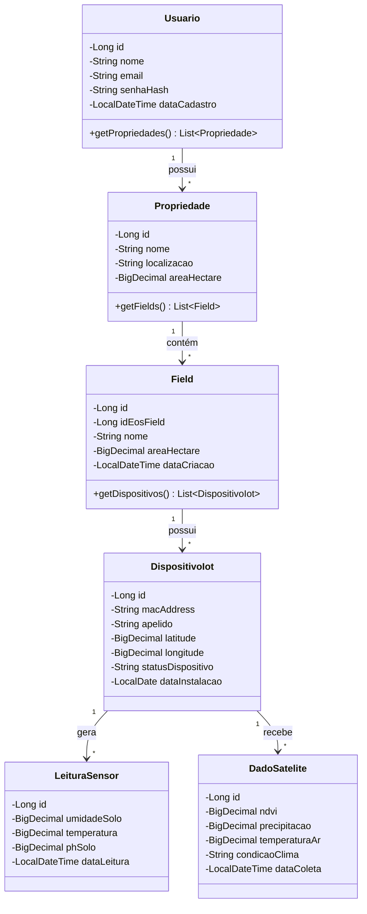

### Diagrama Entidade-Relacionamento (DER)

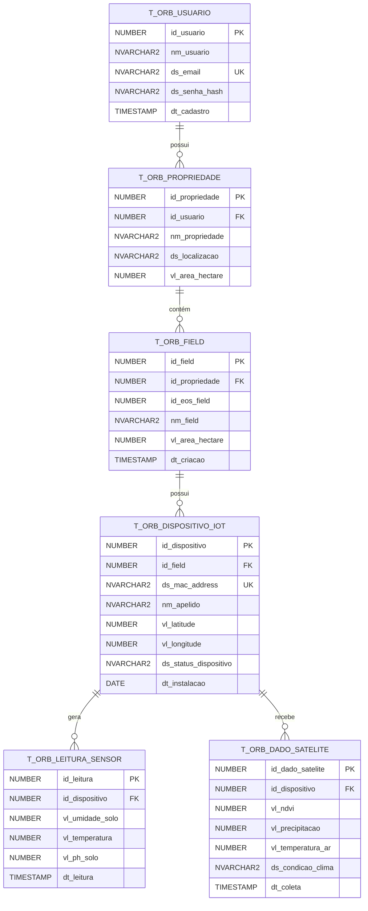

---

## 🗄️ Mapeamento Objeto-Relacional (API Java)

### `T_ORB_USUARIO`

| Atributo Java | Coluna Oracle | Tipo / Constraint |
| :--- | :--- | :--- |
| `id` | `ID_USUARIO` | NUMBER(10) — PK, Identity |
| `nome` | `NM_USUARIO` | NVARCHAR2(100) — NOT NULL |
| `email` | `DS_EMAIL` | NVARCHAR2(100) — NOT NULL, UNIQUE |
| `senhaHash` | `DS_SENHA_HASH` | NVARCHAR2(255) — NOT NULL |
| `dataCadastro` | `DT_CADASTRO` | TIMESTAMP — NOT NULL |

### `T_ORB_PROPRIEDADE`

| Atributo Java | Coluna Oracle | Tipo / Constraint |
| :--- | :--- | :--- |
| `id` | `ID_PROPRIEDADE` | NUMBER(10) — PK, Identity |
| `usuario` | `ID_USUARIO` | NUMBER(10) — FK |
| `nome` | `NM_PROPRIEDADE` | NVARCHAR2(100) — NOT NULL |
| `localizacao` | `DS_LOCALIZACAO` | NVARCHAR2(150) |
| `areaHectare` | `VL_AREA_HECTARE` | NUMBER(10,2) |

### `T_ORB_DISPOSITIVO_IOT`

| Atributo Java | Coluna Oracle | Tipo / Constraint |
| :--- | :--- | :--- |
| `id` | `ID_DISPOSITIVO` | NUMBER(10) — PK, Identity |
| `field` | `ID_FIELD` | NUMBER(10) — FK |
| `macAddress` | `DS_MAC_ADDRESS` | NVARCHAR2(17) — NOT NULL, UNIQUE |
| `latitude` | `VL_LATITUDE` | NUMBER(10,8) |
| `longitude` | `VL_LONGITUDE` | NUMBER(11,8) |
| `statusDispositivo` | `DS_STATUS_DISPOSITIVO` | NVARCHAR2(20) — NOT NULL |
| `dataInstalacao` | `DT_INSTALACAO` | DATE — NOT NULL |

---

## 📁 Estrutura do Projeto (API Java)

```
src/main/java/.../caneorbit/
├── api/
│   ├── controller/         # Interfaces e implementações dos controllers
│   ├── dto/
│   │   ├── request/        # DTOs de entrada (validação com @NotBlank, @Email, etc.)
│   │   └── response/       # DTOs de saída (incluindo HATEOAS links)
│   └── exception/          # GlobalExceptionHandler (@RestControllerAdvice)
├── config/                 # SecurityConfig, CORS, JWT Filter, Swagger
├── domain/
│   ├── model/              # Entidades JPA
│   ├── repository/         # JpaRepository
│   └── service/            # Interfaces e implementações de serviço
└── mapper/                 # Mappers desacoplados (Request ↔ Entity ↔ Response)
```

---

# Disciplina 2: Advanced Business Development with .NET (C#)

## Links vídeos
Video apresentação:
https://youtu.be/5QxZ_6FD8V0?si=kmPXI2dIMqHrGbkF

vídeo pitch:
https://youtu.be/0EFYzRW-o-0?feature=shared

## 🛠️ Tecnologias Utilizadas (C#)

| Tecnologia                 | Finalidade                           |
| -------------------------- | ------------------------------------ |
| .NET 8                     | Framework principal da API           |
| ASP.NET Core Web API       | Desenvolvimento da API REST          |
| Entity Framework Core      | ORM e persistência de dados          |
| Oracle.EntityFrameworkCore | Integração com Oracle Database       |
| Oracle Database            | Banco de dados relacional            |
| Swagger / OpenAPI          | Documentação e testes da API         |
| EOS Data Analytics API     | Coleta de dados de satélite e clima  |
| Google Gemini API          | Geração de análises agrícolas com IA |

---

## 🏗️ Arquitetura da API (C#)

A API foi desenvolvida seguindo boas práticas de arquitetura em camadas:

* Controllers: responsáveis por receber as requisições HTTP.
* Services: responsáveis pelas regras de negócio e integrações externas.
* DTOs: utilizados para entrada e saída de dados.
* Models: representam as entidades persistidas no banco de dados.
* Entity Framework Core: responsável pelo mapeamento objeto-relacional.

---

## 🗄️ Banco de Dados e Relacionamentos (C#)

A aplicação utiliza Oracle Database com persistência via Entity Framework Core.

### Relacionamentos implementados (C#)

* Usuário (1:N) Propriedade
* Propriedade (1:N) Field
* Field (1:N) Dispositivo IoT
* Dispositivo IoT (1:N) Leitura Sensor
* Dispositivo IoT (1:N) Dado Satélite

### Migration

A criação do banco foi realizada através de Migration do Entity Framework Core.

Migration utilizada:

```text
InitialCreate
```

---

## ⚙️ Funcionalidades Implementadas (C#)

### Gestão de Propriedades e Dispositivos

* Cadastro de usuários.
* Cadastro de propriedades agrícolas.
* Cadastro de dispositivos IoT.
* Associação de dispositivos a áreas agrícolas monitoradas.

### Integração com EOS

A API integra-se à plataforma EOS Data Analytics para:

* Criar Fields na EOS.
* Consultar índices de vegetação (NDVI).
* Consultar dados climáticos.
* Obter precipitação.
* Obter temperatura do ar.
* Obter condição climática.

### Monitoramento IoT

A API permite registrar leituras simuladas dos sensores:

* Umidade do solo.
* Temperatura.
* pH do solo.

---

## 🤖 Inteligência Artificial Aplicada (C#)

Como diferencial do projeto, foi implementada integração com a API Google Gemini.

A funcionalidade realiza:

1. Busca da última leitura do sensor IoT.
2. Busca do último dado de satélite e clima.
3. Busca das informações do dispositivo.
4. Busca das informações do Field.
5. Busca das informações da propriedade.
6. Montagem de um contexto agrícola focado em cana-de-açúcar.
7. Envio dos dados para o Gemini.
8. Recebimento de uma análise inteligente.

A resposta retornada contém:

* Resumo da situação da lavoura.
* Alerta identificado.
* Nível de risco.
* Explicação simplificada.
* Recomendação prática.
* Nível de confiança da análise.

# ⚠️ Configuração Obrigatória da API do Gemini

> [!WARNING]
> **As funcionalidades de Inteligência Artificial NÃO funcionarão localmente sem uma chave de API válida do Google Gemini.**
>
> Por questões de segurança, a chave da API não é armazenada no repositório e deve ser configurada manualmente por cada desenvolvedor.

## Como configurar

### 1. Gerar uma API Key

Acesse o Google AI Studio e gere uma chave de API do Gemini.

### 2. Configurar o arquivo `appsettings.json`

Localize a seção de configuração do Gemini e substitua o valor da propriedade `ApiKey` pela sua chave:

```json
"Gemini": {
  "ApiKey": "SUA_API_KEY_AQUI"
}
```

### 3. Executar a aplicação

Após salvar o arquivo, execute o projeto normalmente.

## Possíveis problemas

Se a API Key não estiver configurada corretamente, as funcionalidades de IA poderão:

- Não gerar respostas;
- Retornar erros de autenticação;
- Falhar durante

---

## 📡 Principais Endpoints da API C#

### Leituras de Sensor

| Método | Endpoint                                             | Descrição                                 |
| ------ | ---------------------------------------------------- | ----------------------------------------- |
| GET    | `/api/LeituraSensor`                                 | Lista todas as leituras de sensor         |
| GET    | `/api/LeituraSensor/{id}`                            | Busca uma leitura por ID                  |
| GET    | `/api/LeituraSensor/por-dispositivo/{idDispositivo}` | Lista todas as leituras de um dispositivo |
| POST   | `/api/LeituraSensor`                                 | Registra uma nova leitura de sensor       |
| PUT    | `/api/LeituraSensor/{id}`                            | Atualiza uma leitura existente            |
| DELETE | `/api/LeituraSensor/{id}`                            | Remove uma leitura                        |

#### JSON - POST/PUT LeituraSensor

```json
{
  "idDispositivo": 1,
  "vlUmidadeSolo": 68.5,
  "vlTemperatura": 27.3,
  "vlPhSolo": 6.2
}
```

---

### Dados de Satélite e Clima

| Método | Endpoint                                            | Descrição                                          |
| ------ | --------------------------------------------------- | -------------------------------------------------- |
| GET    | `/api/DadoSatelite`                                 | Lista todos os dados de satélite/clima             |
| GET    | `/api/DadoSatelite/{id}`                            | Busca um dado de satélite por ID                   |
| GET    | `/api/DadoSatelite/por-dispositivo/{idDispositivo}` | Lista todos os dados de satélite de um dispositivo |
| POST   | `/api/DadoSatelite`                                 | Registra manualmente um dado de satélite/clima     |
| PUT    | `/api/DadoSatelite/{id}`                            | Atualiza um dado de satélite/clima                 |
| DELETE | `/api/DadoSatelite/{id}`                            | Remove um dado de satélite/clima                   |
| POST   | `/api/DadoSatelite/coletar/{idDispositivo}`         | Coleta NDVI, clima e salva no banco                |

#### JSON - POST/PUT DadoSatelite

```json
{
  "idDispositivo": 1,
  "vlNdvi": 0.72,
  "vlPrecipitacao": 15.4,
  "vlTemperaturaAr": 28.7,
  "dsCondicaoClima": "Parcialmente Nublado"
}
```

---

### Field

| Método | Endpoint | Descrição |
|----------|----------|----------|
| GET | `/api/Field/por-dispositivo/{idDispositivo}` | Retorna o Field associado ao dispositivo |
| POST | `/api/Field/criar-do-dispositivo/{idDispositivo}` | Cria um Field na EOS utilizando a localização do dispositivo |

#### Exemplo de chamada

```http
POST /api/Field/criar-do-dispositivo/1
```

#### Exemplo de resposta

```json
{
  "idField": 1,
  "idEosField": 123456,
  "nmField": "Field Dispositivo 1",
  "vlAreaHectare": 10.5,
  "idPropriedade": 1
}
```
---

### Integração EOS

| Método | Endpoint | Descrição |
|----------|----------|----------|
| GET | `/api/Eos/ndvi` | Consulta NDVI por latitude e longitude |

----

### Análise Agrícola com IA

| Método | Endpoint                                           | Descrição                                                                                            |
| ------ | -------------------------------------------------- | ---------------------------------------------------------------------------------------------------- |
| GET    | `/api/AnaliseAgricola/dispositivo/{idDispositivo}` | Gera análise agrícola com Gemini usando a última leitura do sensor e o último dado de satélite/clima |

#### Exemplo de chamada IA

```http
GET /api/AnaliseAgricola/dispositivo/1
```

---

## 🧪 Exemplos de Testes dos Novos Endpoints

### Buscar todas as leituras de um dispositivo

```http
GET /api/LeituraSensor/por-dispositivo/1
```

### Buscar todos os dados de satélite de um dispositivo

```http
GET /api/DadoSatelite/por-dispositivo/1
```

### Buscar Field associado a um dispositivo

```http
GET /api/Field/por-dispositivo/1
```

---

## 🧪 Exemplo de Teste da IA (C#)

### Requisição

```http
GET /api/AnaliseAgricola/dispositivo/1
```

### Resposta

```json
{
  "resumo": "Os dados sugerem redução do vigor vegetativo.",
  "alerta": "Possível risco hídrico.",
  "nivelRisco": "Médio",
  "explicacaoSimples": "O NDVI baixo e a ausência de precipitação indicam possível estresse da cultura.",
  "recomendacaoPratica": "Verificar irrigação e condições do solo.",
  "confiancaAnalise": "Alta"
}
```

---

## ✅ Evidências de Testes (C#)

Testes realizados através do Swagger:

* Cadastro de usuário.
* Cadastro de propriedade.
* Cadastro de dispositivo IoT.
* Criação de Field na EOS.
* Consulta de Field por dispositivo.
* Registro de leitura de sensor.
* Consulta de leituras por dispositivo.
* Coleta de dados de satélite.
* Consulta de dados de satélite por dispositivo.
* Coleta de dados climáticos.
* Geração de análise agrícola utilizando IA.
* Criação de Field a partir de dispositivo.
* Consulta de Field por dispositivo.

Todos os endpoints foram validados com sucesso utilizando dados reais fornecidos pela EOS e análises geradas pelo Gemini.

---

## 🚀 Diferencial e Inovação

O principal diferencial da solução é a integração entre:

```text
Dispositivo IoT
        ↓
Oracle Database
        ↓
EOS Data Analytics
        ↓
Google Gemini
        ↓
Análise Agrícola Inteligente
```

A solução transforma dados brutos de sensores e satélite em recomendações agrícolas compreensíveis para apoiar a tomada de decisão do produtor rural.

# Disciplina 3: DevOps Tools & Cloud Computing

## 🏗️ Arquitetura Macro da Solução na Nuvem

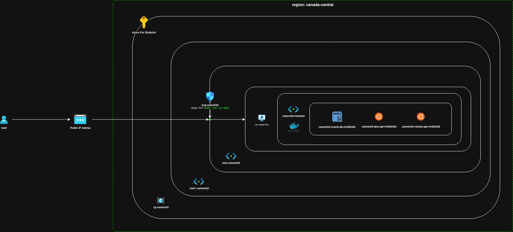

*Diagrama mostrando a estrutura completa na nuvem com API Java, API C#, Oracle Database, e integrações com serviços externos (EOS e Gemini).*

```
                    ┌─────────────────────────────────────────────────────────┐
                    │                    Azure Cloud                          │
                    │                                                         │
                    │   ┌─────────────────┐      ┌─────────────────────────┐  │
                    │   │                 │      │                         │  │
    Usuário ────────►   │  API Java       │      │     Oracle Database     │  │
    (Frontend/       │   │  (Spring Boot)  │◄────►│     (Containerizado)    │  │
     Mobile/         │   │  Porta: 8080    │      │     Porta: 1521         │  │
     Insomnia)       │   │                 │      │                         │  │
                    │   └─────────────────┘      └─────────────────────────┘  │
                    │           │                                             │
                    │           │                                             │
                    │   ┌─────────────────┐                                  │
                    │   │                 │                                  │
                    │   │  API C#         │                                  │
                    │   │  (ASP.NET Core) │                                  │
                    │   │  Porta: 5000    │                                  │
                    │   │                 │                                  │
                    │   └────────┬────────┘                                  │
                    │            │                                           │
                    └────────────┼───────────────────────────────────────────┘
                                 │
                                 ▼
                    ┌─────────────────────────────────────┐
                    │                                     │
                    │         Serviços Externos           │
                    │  ┌─────────────┐  ┌─────────────┐   │
                    │  │  API EOS    │  │  Gemini AI  │   │
                    │  │  (Satélite) │  │  (Google)   │   │
                    │  └─────────────┘  └─────────────┘   │
                    │                                     │
                    └─────────────────────────────────────┘
```

---

## ☁️ Deploy na Azure (MVP para Disciplina)

### Infraestrutura Criada

| Recurso | Valor |
|:---|:---|
| Resource Group | rg-caneorbit-sprint1 |
| Virtual Machine | vm-caneorbit-api |
| Usuário | caneorbitadmin |
| Região | brazilsouth |
| Tamanho | Standard_B2s |

### Evidências do Deploy na Azure

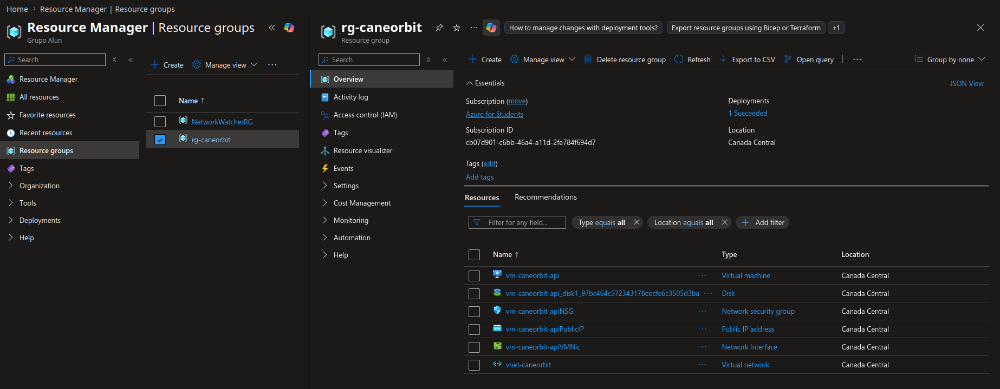

---

## 🐳 Containerização com Docker

### Dockerfile (API Java)

```dockerfile
FROM eclipse-temurin:21-jdk-alpine

RUN addgroup -S caneorbitgroup && adduser -S caneorbituser -G caneorbitgroup

WORKDIR /app

COPY target/*.jar app.jar

USER caneorbituser

EXPOSE 8080

ENTRYPOINT ["java", "-jar", "app.jar"]
```

### Dockerfile (API C#)

```dockerfile
FROM mcr.microsoft.com/dotnet/sdk:8.0 AS build
WORKDIR /src
COPY ["CaneOrbis.Api.csproj", "."]
RUN dotnet restore "CaneOrbis.Api.csproj"
COPY . .
RUN dotnet build "CaneOrbis.Api.csproj" -c Release -o /app/build

FROM mcr.microsoft.com/dotnet/aspnet:8.0 AS runtime
WORKDIR /app
RUN adduser --system --group --no-create-home appuser
USER appuser
EXPOSE 8080
COPY --from=build /app/build .
ENTRYPOINT ["dotnet", "CaneOrbis.Api.dll"]
```

### docker-compose.yml

```yaml
services:
  db:
    container_name: caneorbit-oracle-db-rm566385
    image: gvenzl/oracle-xe:latest
    restart: always
    environment:
      - ORACLE_PASSWORD=${DB_PASSWORD}
    ports:
      - "1521:1521"
    networks:
      - caneorbit_network
    volumes:
      - db_data:/opt/oracle/oradata
    healthcheck:
      test: ["CMD-SHELL", "echo 'SELECT 1 FROM DUAL;' | sqlplus -s SYSTEM/${DB_PASSWORD}@//localhost:1521/XE"]
      interval: 30s
      timeout: 10s
      retries: 10
      start_period: 60s

  app-csharp:
    container_name: caneorbit-csharp-api-rm566385
    build:
      context: .
      dockerfile: Dockerfile
    restart: always
    ports:
      - "5000:8080"
      - "5001:8081"
    environment:
      ConnectionStrings__OracleConnection: "User Id=SYSTEM;Password=${DB_PASSWORD};Data Source=db:1521/XE;"
      ASPNETCORE_ENVIRONMENT: Development
      ASPNETCORE_URLS: http://+:8080
    depends_on:
      db:
        condition: service_healthy
    networks:
      - caneorbit_network

  app-java:
    container_name: caneorbit-java-api-rm566385
    build:
      context: ./caneorbitJava
      dockerfile: Dockerfile
    restart: always
    ports:
      - "8080:8080"
    environment:
      SPRING_DATASOURCE_URL: jdbc:oracle:thin:@db:1521/XE
      SPRING_DATASOURCE_USERNAME: SYSTEM
      SPRING_DATASOURCE_PASSWORD: ${DB_PASSWORD}
      API_SECURITY_TOKEN_SECRET: ${JWT_SECRET}
    depends_on:
      db:
        condition: service_healthy
    networks:
      - caneorbit_network

networks:
  caneorbit_network:
    driver: bridge

volumes:
  db_data:
```

### Arquivo .env

```env
DB_PASSWORD=oracle123
JWT_SECRET=minha-chave-secreta-123
```

---

## 📸 Evidências DevOps

### Containers em Execução

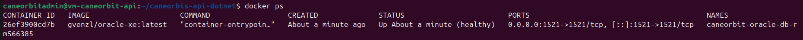

```bash
$ docker ps
```

---

### Acesso ao Container Java

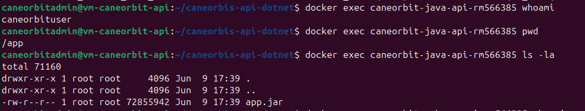

```bash
$ docker exec -it caneorbit-java-api-rm566385 sh
/app $ whoami
/app $ pwd
/app $ ls -la
```

---

### Acesso ao Container C#

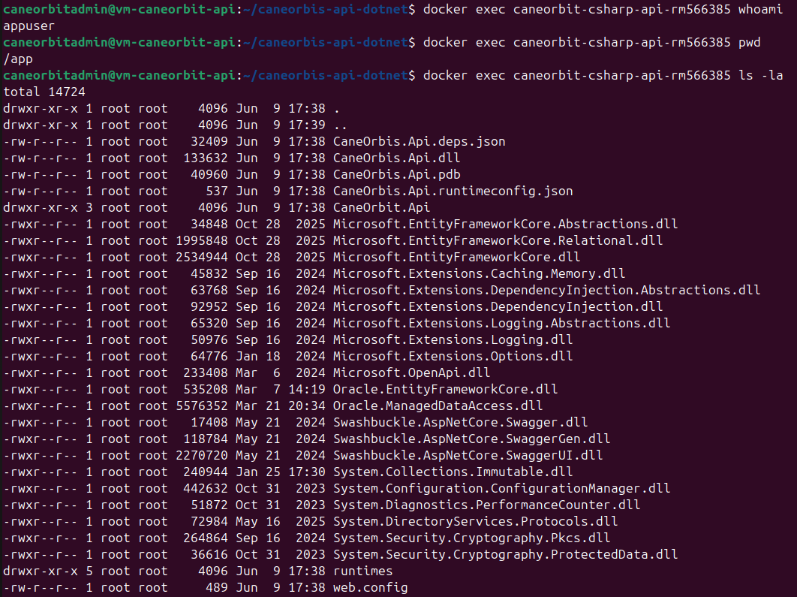

```bash
$ docker exec -it caneorbit-csharp-api-rm566385 sh
/app $ whoami
/app $ pwd
/app $ ls -la
```

---

### Logs dos Containers

#### Logs API Java

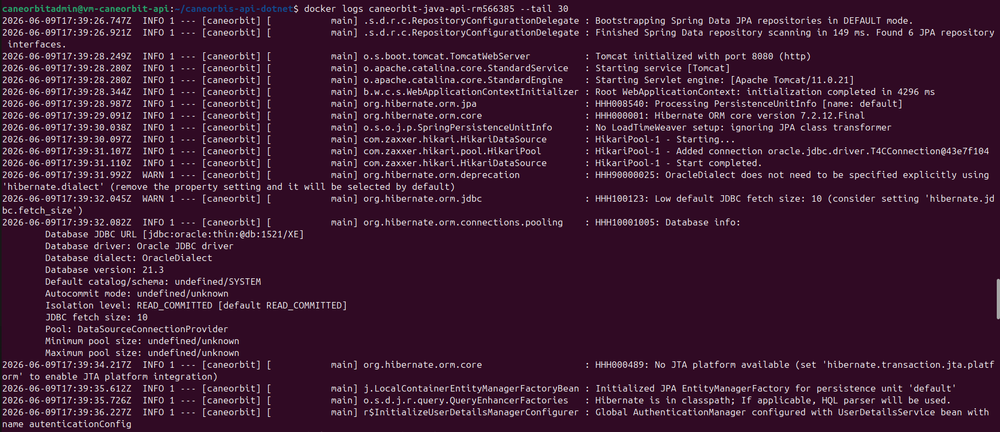

```bash
$ docker logs caneorbit-java-api-rm566385 --tail 30
```

#### Logs API C#

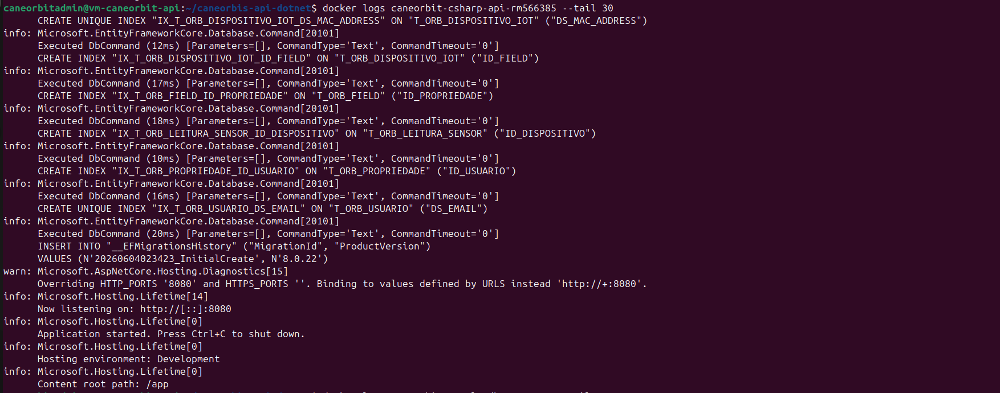

```bash
$ docker logs caneorbit-csharp-api-rm566385 --tail 30
```

---

### SELECT no Banco de Dados

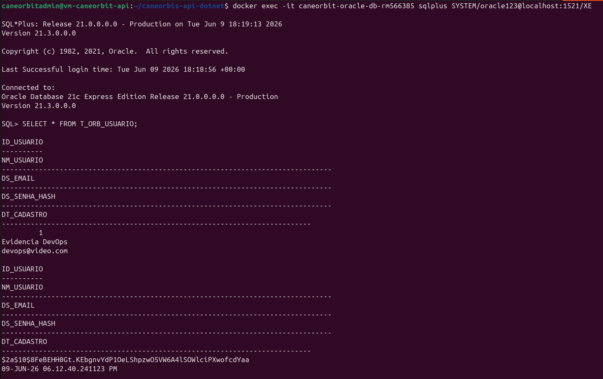

```bash
$ docker exec -it caneorbit-oracle-db-rm566385 sqlplus SYSTEM/oracle123@localhost:1521/XE

SQL> SELECT * FROM T_ORB_USUARIO;
SQL> SELECT * FROM T_ORB_PROPRIEDADE;
SQL> SELECT * FROM T_ORB_DISPOSITIVO_IOT;
SQL> SELECT * FROM T_ORB_LEITURA_SENSOR;
SQL> EXIT;
```

---

### Teste das APIs

#### Teste de Criação de Usuário

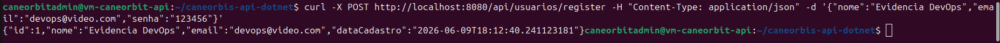

```bash
$ curl -X POST http://localhost:8080/api/usuarios/register \
  -H "Content-Type: application/json" \
  -d '{"nome":"Teste DevOps","email":"devops@teste.com","senha":"123456"}'
```

#### Teste de Login

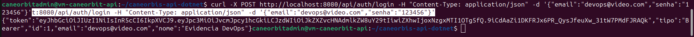

```bash
$ curl -X POST http://localhost:8080/api/auth/login \
  -H "Content-Type: application/json" \
  -d '{"email":"devops@teste.com","senha":"123456"}'
```

#### Swagger UI API Java

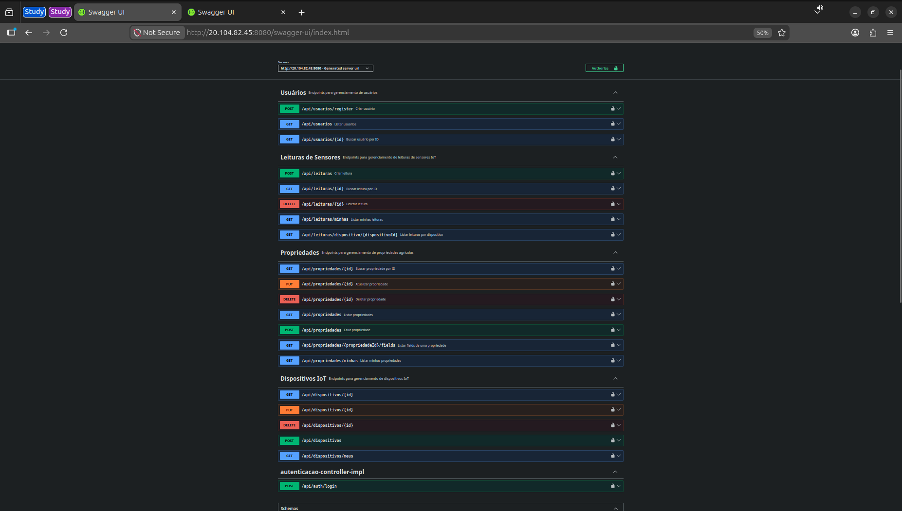

```bash
# Acessar no navegador: http://<IP_DA_VM>:8080/swagger-ui/index.html
```

#### Swagger UI API C#

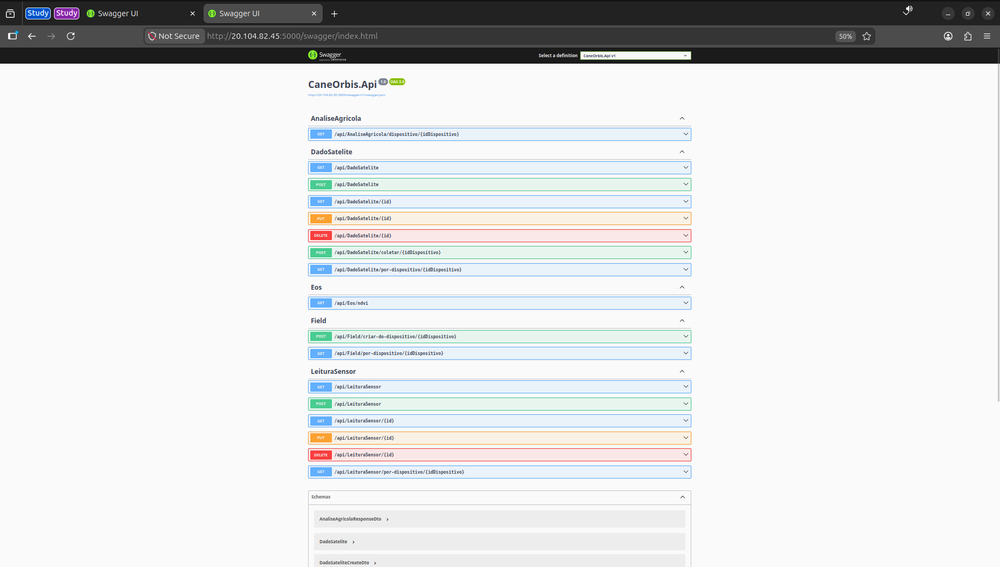

```bash
# Acessar no navegador: http://<IP_DA_VM>:5000/swagger
```

---

## 🚀 Como Executar o Deploy Localmente

### Pré-requisitos

- **Git**
- **Docker Desktop**
- **Docker Compose**

### Passo a Passo

**1. Clone o repositório**

```bash
git clone https://github.com/FIAP-CANEORBIT/caneorbis-api-dotnet.git
cd caneorbis-api-dotnet
```

**2. Configure o arquivo `.env`**

```bash
cat > .env << 'EOF'
DB_PASSWORD=oracle123
JWT_SECRET=minha-chave-secreta-123
EOF
```

**3. Execute com Docker Compose**

```bash
docker compose up -d --build
```

**4. Verifique a execução**

```bash
docker ps
docker logs caneorbit-java-api-rm566385 --tail 50
docker logs caneorbit-csharp-api-rm566385 --tail 50
```

**5. Acesse as aplicações**

| Serviço | URL Local |
|:---|:---|
| API Java | http://localhost:8080 |
| Swagger Java | http://localhost:8080/swagger-ui/index.html |
| API C# | http://localhost:5000 |
| Swagger C# | http://localhost:5000/swagger |

---

## ☁️ Deploy no Render (Produção Alternativa)

Os serviços já estão em produção nos links:

| Serviço | URL Produção |
|:---|:---|
| API Java | https://caneorbis-api-java.onrender.com |
| Swagger Java | https://caneorbis-api-java.onrender.com/swagger-ui/index.html |
| API C# | https://caneorbis-api-dotnet.onrender.com |
| Swagger C# | https://caneorbis-api-dotnet.onrender.com/swagger |

---

## 🎥 Vídeo Demonstrativo

[](https://www.youtube.com/watch?v=PygFG75NVcg)

> **Assista no YouTube:** https://www.youtube.com/watch?v=PygFG75NVcg

---

## 👥 Integrantes

| Nome | RM |
|:---|:---|
| Diego Andrade | RM566385 |
| Grazielle De Alencar | RM561529 |
| Julia Corrêa | RM564870 |

---

## 📅 Prazo de Entrega

**Data Final da Sprint 1:** 09/06/2026 às 23:55

---

## 🔗 Links Importantes

> **Repositório GitHub:** https://github.com/FIAP-CANEORBIT/caneorbis-api-dotnet
>
> **Repositório Java:** https://github.com/FIAP-CANEORBIT/fiap-2tdspo-caneorbit-java
>
> **Swagger Java (Produção):** https://caneorbis-api-java.onrender.com/swagger-ui/index.html
>
> **Swagger C# (Produção):** https://caneorbis-api-dotnet.onrender.com/swagger
>
> **Vídeo Demonstrativo:** https://www.youtube.com/watch?v=PygFG75NVcg
